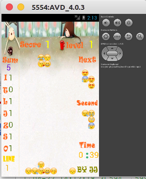

#Tetris
A simple Tetris app.

##Package doc

###finalize.tetris.activity
所有Activity，均由View绘制

>####LoadActivity
>游戏启动Activity

>####MainActivity
>游戏主Activity

###finalize.tetris.controller
游戏控制器

>####GameController
>控制方块的移动

>####GestureListener
>监听手势，判断方向控制

>####MusicController
>控制背景音乐与音效

###finalize.tetris.view
Activity 使用的界面

>####GameView
>游戏主界面

>####LoadView
>游戏启动界面

###效果图

